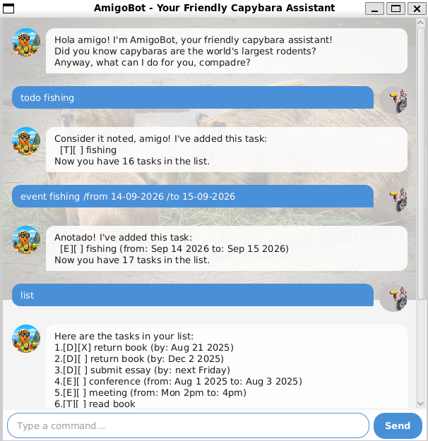

# AmigoBot User Guide



AmigoBot is your friendly capybara assistant for managing tasks! It supports
todos, deadlines, and events, with features like date-based lookup, keyword
search, and mass operations. Commands are **case-insensitive**.

## Quick Start

1. Ensure you have **Java 25** installed.
2. Download the latest `amigobot.jar` from the releases page.
3. Run `java -jar amigobot.jar` to start the GUI.
4. Type a command in the text field and press **Enter** or click **Send**.

## Features

- [Adding a todo: `todo`](#adding-a-todo-todo)
- [Adding a deadline: `deadline`](#adding-a-deadline-deadline)
- [Adding an event: `event`](#adding-an-event-event)
- [Listing all tasks: `list`](#listing-all-tasks-list)
- [Marking tasks as done: `mark`](#marking-tasks-as-done-mark)
- [Marking tasks as not done: `unmark`](#marking-tasks-as-not-done-unmark)
- [Deleting tasks: `delete`](#deleting-tasks-delete)
- [Finding tasks by keyword: `find`](#finding-tasks-by-keyword-find)
- [Finding tasks by date: `on`](#finding-tasks-by-date-on)
- [Exiting the program: `bye`](#exiting-the-program-bye)
- [Saving data](#saving-data)

---

### Adding a todo: `todo`

Adds a task with no date attached.

Format: `todo DESCRIPTION`

Example: `todo read book`

```
Got it, compadre! I've added this task:
  [T][ ] read book
Now you have 1 tasks in the list.
```

### Adding a deadline: `deadline`

Adds a task with a due date.

Format: `deadline DESCRIPTION /by DATE_OR_TEXT`

- If `DATE_OR_TEXT` is in `yyyy-MM-dd` or `dd/MM/yyyy` format, it is stored as
  a date and displayed as e.g. `Dec 2 2025`.
- Otherwise, it is stored as plain text.

Examples:

`deadline return book /by 2025-12-02`

```
Got it, compadre! I've added this task:
  [D][ ] return book (by: Dec 2 2025)
Now you have 2 tasks in the list.
```

`deadline submit report /by Friday`

```
Got it, compadre! I've added this task:
  [D][ ] submit report (by: Friday)
Now you have 3 tasks in the list.
```

### Adding an event: `event`

Adds a task with a start and end time.

Format: `event DESCRIPTION /from START /to END`

- Dates in `yyyy-MM-dd` or `dd/MM/yyyy` format are parsed and displayed as
  e.g. `Aug 1 2025`. Other values are stored as plain text.

Example: `event team meeting /from Mon 2pm /to 4pm`

```
Got it, compadre! I've added this task:
  [E][ ] team meeting (from: Mon 2pm to: 4pm)
Now you have 4 tasks in the list.
```

### Listing all tasks: `list`

Displays all tasks with their status and index number.

Format: `list`

```
Here are the tasks in your list:
1.[T][ ] read book
2.[D][ ] return book (by: Dec 2 2025)
3.[D][ ] submit report (by: Friday)
4.[E][ ] team meeting (from: Mon 2pm to: 4pm)
```

### Marking tasks as done: `mark`

Marks one or more tasks as completed.

Format: `mark INDEX [MORE_INDICES...]`

- Supports individual indices: `mark 1 3 5`
- Supports ranges: `mark 1-3`
- Supports a mix: `mark 1-3 5`

Example: `mark 1`

```
Muy bien! I've marked this task as done:
  [T][X] read book
```

Example: `mark 2-4`

```
Muy bien! I've marked this task as done:
  [D][X] return book (by: Dec 2 2025)
  [D][X] submit report (by: Friday)
  [E][X] team meeting (from: Mon 2pm to: 4pm)
```

### Marking tasks as not done: `unmark`

Marks one or more tasks as not yet completed.

Format: `unmark INDEX [MORE_INDICES...]`

- Supports the same index formats as `mark` (individual, ranges, or mixed).

Example: `unmark 1`

```
No worries, compadre! I've marked this task as not done yet:
  [T][ ] read book
```

### Deleting tasks: `delete`

Removes one or more tasks from the list.

Format: `delete INDEX [MORE_INDICES...]`

- Supports individual indices: `delete 1 3`
- Supports ranges: `delete 1-3`
- Supports a mix: `delete 1-2 4`

Example: `delete 4`

```
Noted, compadre! I've removed this task:
  [E][X] team meeting (from: Mon 2pm to: 4pm)
Now you have 3 tasks in the list.
```

### Finding tasks by keyword: `find`

Searches for tasks whose description contains the given keyword
(case-insensitive).

Format: `find KEYWORD`

Example: `find book`

```
Here are the matching tasks in your list:
1.[T][ ] read book
2.[D][X] return book (by: Dec 2 2025)
```

### Finding tasks by date: `on`

Lists all deadlines due on and events occurring on a specific date.

Format: `on DATE`

- Date must be in `yyyy-MM-dd` or `dd/MM/yyyy` format.

Example: `on 2025-12-02`

```
Here are the tasks on Dec 2 2025:
1.[D][X] return book (by: Dec 2 2025)
```

### Exiting the program: `bye`

Exits AmigoBot. The window closes automatically after a short delay.

Format: `bye`

```
Adios amigo! Hope to see you again soon!
```

### Saving data

Task data is saved automatically to `data/amigobot.txt` after every command
that changes the task list. There is no need to save manually.

If the data file is missing or corrupted on startup, AmigoBot starts with an
empty task list (corrupted lines are skipped with a warning).

## Command Summary

| Action | Format |
|--------|--------|
| Todo | `todo DESCRIPTION` |
| Deadline | `deadline DESCRIPTION /by DATE_OR_TEXT` |
| Event | `event DESCRIPTION /from START /to END` |
| List | `list` |
| Mark | `mark INDEX [MORE_INDICES...]` |
| Unmark | `unmark INDEX [MORE_INDICES...]` |
| Delete | `delete INDEX [MORE_INDICES...]` |
| Find | `find KEYWORD` |
| On | `on DATE` |
| Bye | `bye` |
